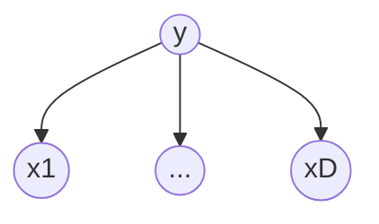
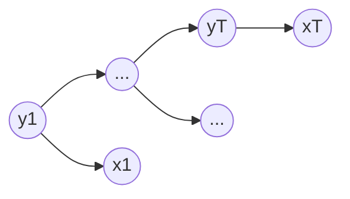

本文整理条件随机场的相关知识。

<!--more-->
前面 [概率模型](2022/02/14/ml/prob_model) 一文中讲了概率图模型，包括有向图（贝叶斯网络）和无向图（Markov 随机场）。本文主要讲无向图模型中的条件随机场（CRF）。

# 1. 概率模型

**无向图**

考虑一组随机变量 $\mathbf y=[y_1,\ldots, y_D]$，每个变量取值范围 $y_i \in \mathcal Y$，可以是连续型或离散型，但本文主要考虑离散型。无向图的联合概率可以根据最大团进行因子化分解，即

$$p(\mathbf y)=\frac 1 Z \prod_{a=1}^A \Psi_a(\mathbf y_a) \tag{1}$$

其中，$a$ 是最大团的 index， $\Psi$ 是势函数，任意非负的函数均可，即 $\Psi_a(\mathbf y_a) \ge 0$。$A$ 表示最大团的数量 $A\le D$。$Z$ 用于归一化，且与 $\color{magenta} {\mathbf y}$ 的取值无关，

$$Z=\sum_{\mathbf y'} \prod_{a=1}^A \Psi_a(\mathbf y_a')$$

（如果 $\Psi_a(\mathbf y_a)$ 就取对应最大团的条件概率，那么 $Z=1$）

**有向图**

$$p(\mathbf y)=\prod_{i=1}^D p(y_i|\mathbf y_{\pi(i)}) \tag{2}$$

其中 $\pi(i)$ 表示节点 $i$ 的父节点集合。上式表示联合概率可因式分解为每个节点的条件概率（以其所有父节点为条件）的乘积。

**输入输出**

输入变量 $\mathbf x$ 是可观察变量，输出变量 $\mathbf y$ 是隐变量，例如中文分词，中文句子就是 $\mathbf x$，每个字符的分类（例如 `B,M,E,S`）就是 $\mathbf y$。那么联合概率分布为

$$p(\mathbf x,\mathbf y)=\frac 1 Z \prod_{a=1}^A \Psi_a(\mathbf x_a, \mathbf y_a) \tag{3}$$

其中归一化因子 

$$Z=\sum_{\mathbf x, \mathbf y} \prod_a^A \Psi_a(\mathbf x_a, \mathbf y_a)$$

# 2. 生成模型 vs 判别模型

生成模型描述了标签 $\mathbf y$ 如何概率地生成可观察变量 $\mathbf x$，判别模型则相反地，描述了如何将 $\mathbf x$ 关联到其标签 $\mathbf y$。通常来说，生成模型需要计算 $p(\mathbf x, \mathbf y)$，而判别模型计算 $p(\mathbf y|\mathbf x)$。

例如中文分词，给定句子 $\mathbf x^{\star}$ ，要得到每个字符的标签（`B,M,E,S` 中的一个）：

1. 生成模型

    $$\mathbf y^{\star}=\arg \max_{\mathbf y} p(\mathbf x^{\star}, \mathbf y) \tag{4}$$
2. 判别模型

    $$\mathbf y^{\star}=\arg \max_{\mathbf y} p(\mathbf y|\mathbf x^{\star}) \tag{5}$$

虽然通过贝叶斯定理，这两种计算方法可以相互转化，但是实际中我们还是对这两种方法进行区分。

下文生成模型记为 `G`，判别模型记为 `D`。

## 2.1 分类

给定特征向量 $\mathbf x=(x_1,\ldots,x_D)$，预测一个对应分类 $y$，

### 2.1.1 生成模型

> 朴素贝叶斯假设：给定分类标签，各特征之间独立。

联合概率分布

$$p(y,\mathbf x)=p(y)\prod_{i=1}^D p(x_i|y) \tag{6}$$

概率图如下所示

**应用例子：句子主题分类**

将句子分词，词对应 $x_i$，句子主题分类对应 $y$，$y \in \mathcal Y$，$|\mathcal Y|=C$，即一共 $C$ 个分类。给定一个数据集 $\{(\mathbf x_n, y_n)|n=1,\ldots, N\}$，

$$p(y)=\frac {\sum_{n=1}^N \mathbf 1_{y_n=y}} {N} \tag{7-1}$$

$$p(x_i|y)=\sum_{x_{nm}, y_n} \mathbf 1_{x_{nm}=x_i, y_n=y} /\sum_{x_{nm, y_n}} \mathbf 1_{y_n=y} \tag{8-1}$$

上式中，$\sum_{x_{nm},y_n}$ 表示将每个句子展开 $(\mathbf x_n,y_n) \rightarrow ((x_{n1}, y_n),\ldots, (x_{nD_n},y_n))$，得到所有的 $(x_{nm},y_n)$ pair。

**拉普拉斯平滑：**

有时候数据没有全面覆盖，导致 (7) 或 (8) 式计算为 `0`，此时需要进行拉普拉斯平滑处理：

$$p(y)=\frac {1+\mathbf 1_{y_n=y}} {C+N} \tag{7-2}$$

当 $N \gg C$ 时，(7-2) 与 (7-1) 差别甚微。

当然通常情况下，数据集大小不会特别小，所有标签分类都能覆盖到的情况下，还是使用 (7-1) 进行计算标签分类的先验概率。

对于 (8-1) 式，我们需要事先知道词汇集 $V$，然后才能判断 pair $(x_i，y)$ 出现的频次，如果存在频次为 `0` 的 pair，那么则需要对 (8-1) 进行拉普拉斯平滑处理，

$$p(x_i|y)=\left(1+\sum_{x_{nm}, y_n} \mathbf 1_{x_{nm}=x_i, y_n=y} \right)/\left(V+\sum_{x_{nm, y_n}} \mathbf 1_{y_n=y}\right) \tag{8-2}$$

其中 $V$ 表示词汇集大小（根据上下文很容易判别 $V$ 表示词汇集，还是词汇集大小）。

### 2.1.2 判别模型

> logistic 回归，又称 最大熵分类器 ME

条件概率

$$p(y|\mathbf x)=\frac 1 {Z(\mathbf x)} \exp \left(\theta_y+\sum_{i=1}^D \theta_{yi}x_i \right) \tag{9}$$

其中 $Z(\mathbf x)=\sum_y \exp(\theta_y+\sum_{i=1}^D \theta_{yi}x_i)$

将 (9) 式进行改写，

$$p(y|\mathbf x)=\frac 1 {Z(\mathbf x)} \exp \left(\sum_{i=1}^D \theta_i f_i(y, \mathbf x)\right) \tag{10}$$

## 2.2 序列模型

输出是一个序列 $\mathbf y$ 而非单个值 $y$。

例如命名实体识别（NER）中，将一个句子先分词，每个词都是一个实体的一部分，例如 "李白" 是 `PERSON`，"纽约" 是 `LOCATION`，"清华大学" 是 `ORGANIZATION`，或者 "早上" 是 `OTHER`（表示这不属于实体的一部分）。

### 2.2.1 HMM

HMM 属于生成模型，$\mathbf x$ 为可观测量（例如句子中的单词），$\mathbf y$ 为隐变量（例如单词的 label），联合概率为

$$p(\mathbf x, \mathbf y)=p(\mathbf y)p(\mathbf x|\mathbf y)=\prod_{t=1}^T p(y_t|y_{t-1})p(x_t|y_t) \tag{11}$$

其中 $p(y_0)=1$，$p(y_1|y_0)=p(y_1)$。序列模型中 $\mathbf x$ 可看作是时序变量，下标通常用 $t$ 表示。HMM 概率图模型如下图所示，

常见的生成模型与判别模型的关系如下图，

### 2.2.2 线性 CRF

考虑 HMM 中联合概率 $p(\mathbf x, \mathbf y)$ 对应的条件概率 $p(\mathbf y|\mathbf x)$，此时将图中边的箭头去掉，从有向图变成对应的无向图。

将 (11) 式改写如下

$$p(\mathbf x,\mathbf y)=\frac 1 Z \prod_{t=1}^T \exp \left(\sum_{i,j \in S} \theta_{ij} \mathbf 1_{y_t=j}\mathbf 1_{y_{t-1}=i}+ \sum_{j \in S, o \in O} \mu_{jo} \mathbf 1_{y_t=j} \mathbf 1_{x_t=o} \right) \tag{12}$$

其中 $\exp(\cdot)$ 的第一项对应 $p(y_t|y_{t-1})$，第二项对应 $p(x_t|y_t)$。

特殊地，如果 $\theta_{ij}=\log p(y_t|y_{t-1})$，$\mu_{jo}=\log p(x_t|y_t)$，那么 $Z=1$。

引入特征方程，进一步简化 (11) 式，每个特征方程具有形式 $f_k(y_t,y_{t-1}, x_t)$，

$$p(\mathbf x, \mathbf y)=\frac 1 Z \prod_{t=1}^T \exp \left(\sum_{k=1}^K \theta_k f_k(y_t, y_{t-1},x_t)\right) \tag{13}$$

于是得到 HMM 对应的线性 CRF 的条件概率为

$$p(\mathbf y|\mathbf x)=\frac {p(\mathbf x, \mathbf y)}{\sum_{\mathbf y'}p(\mathbf x, \mathbf y')}=\frac {\prod_{t=1}^T \exp \left(\sum_{k=1}^K \theta_k f_k(y_t, y_{t-1},x_t)\right)}{\sum_{\mathbf y'}\prod_{t=1}^T \exp \left(\sum_{k=1}^K \theta_k f_k(y_t', y_{t-1}',x_t)\right)} \tag{14}$$

如果每个时刻的输入是多维变量 $\mathbf x_t \in \mathbb R^D$（D-维输入特征），那么线性 CRF 为

$$p(\mathbf y|\mathbf x) =\frac 1 {Z(\mathbf x)} \prod_{t=1}^T \Psi_t(y_t,y_{t-1},\mathbf x_t) \tag{15}$$

其中 $\mathbf x \in \mathbb R^{T \times D}$，归一化因子 $Z(\mathbf x)=\sum_{\mathbf y'} \prod_{t=1}^T \Psi_t(y_t,y_{t-1},\mathbf x_t)$，且

$$\Psi_t(y_t,y_{t-1},\mathbf x_t)=\exp \left(\sum_{k=1}^K \theta_k f_k(y_t, y_{t-1},x_t)\right)$$ 

称为 local function（最大团势函数）。

线性 CRF 概率图如下图所示，

HMM 中下一时刻的状态仅与当前时刻的状态相关，在 CRF 中我们还可以增加特征：下一时刻状态与当前输入 $\mathbf x_{t-1}$ 也相关，即特征方程

$$f_k(y_t, y_{t-1}, x_{t-1})=\mathbf 1_{y_t=j}\mathbf 1_{y_{t-1}=i} \mathbf 1_{x_{t-1}=o}$$

相关概率图如下所示

还可以进一步泛化为状态依赖全局输入，如下图

## 2.2.3 泛化 CRF

根据最大团进行因式分解联合概率，

$$p(\mathbf y|\mathbf x)=\frac 1 {Z(\mathbf x)} \prod_{a=1}^A \Psi_a(\mathbf y_a, \mathbf x_a) \tag{16}$$

其中 $a$ 是最大团的 index，最大团数量为 $A$，$\Psi_a \ge 0$ 是势函数，$\mathbf x_a, \mathbf y_a$ 是最大团 $a$ 中的节点集合。

特殊地，线性 CRF 指 $\mathbf y$ 各节点线性连接，即一阶 pair $(y_{t-1}, y_t)$，此时最大团 $\Psi(\mathbf y_a, \mathbf x_a)$ 为 $\Psi_t (y_t, y_{t-1},\mathbf x)$，有 $T$ 个最大团。