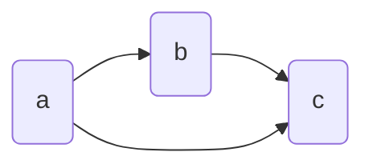
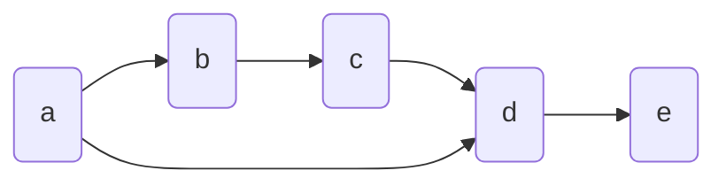
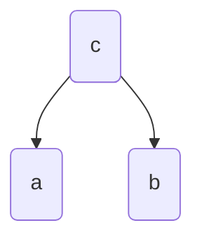
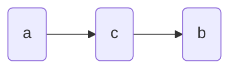
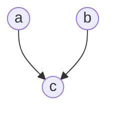
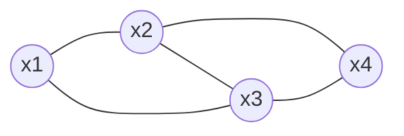

总结概率和概率图模型。
<!--more-->

# 1. 参数估计

**MLE**

最大似然估计

$$\mathcal L(\boldsymbol \theta)=-\log p(\mathbf x|\boldsymbol \theta)$$

监督学习中，每个数据 $\mathbf x_i$ 均有对应的 label 为 $y_i$，那么对于 size 为 $N$ 的数据集，负对数似然为
$$\mathcal L(\boldsymbol \theta)=-\sum_{i=1}^N \log p(y_n|\mathbf x_i, \boldsymbol \theta)$$

MLE 的一个缺点：容易过拟合。

**MAE**

最大后验估计

MLE 中将参数 $\boldsymbol \theta$ 看作一个未知但是确定不变的量，MAE 中将 $\boldsymbol \theta$ 看作一个随机变量，其有一个先验分布 $p(\boldsymbol \theta)$，那么后验概率为
$$p(\boldsymbol \theta|\mathbf x)=\frac {p(\mathbf x|\boldsymbol \theta)p(\boldsymbol \theta)} {p(\mathbf x)}$$


最大化后验概率求参数估计，

$$\max_{\boldsymbol \theta} \ p(\boldsymbol \theta|\mathbf x)=\max_{\boldsymbol \theta} p(\mathbf x|\boldsymbol \theta) \ p(\boldsymbol \theta)$$

其中，$\mathbf x$ 是给定的已知观察量，在 MAE 过程中，$p(\mathbf x)$ 为一个确定不变的量。

# 2. 概率模型
上一节内容为参数估计的两种常用方法，其中要求似然概率，就需要确定模型。

## 2.1 贝叶斯推断

数据集 $\mathcal X$，参数先验 $p(\boldsymbol \theta)$，后验为
$$p(\boldsymbol \theta|\mathcal X)=\frac {p(\mathcal X|\boldsymbol \theta)p(\boldsymbol \theta)}{p(\mathcal X)} \tag{1}$$

数据集似然为
$$p(\mathcal X)=\int p(\mathcal X|\boldsymbol \theta)p(\boldsymbol \theta)d \boldsymbol \theta \tag{2}$$

单个数据样本的概率

$$p(\mathbf x)=\int p(\mathbf x|\boldsymbol \theta)p(\boldsymbol \theta) d \boldsymbol \theta =\mathbb E_{\boldsymbol \theta}[p(\mathbf x|\boldsymbol \theta)] \tag{3}$$

贝叶斯推断与 MLE 和 MAP 的区别：
1. MLE 和 MAP 是点估计，求 $\boldsymbol \theta$ 的最可能的值 $\boldsymbol \theta^{\star}$，推断阶段计算 $p(\mathbf x^{new}|\boldsymbol \theta^{\star})$ 。
2. 贝叶斯推断，根据 (1) 和 (2) 式（这两个等式中 $p(\boldsymbol \theta)$ 为先验）求后验概率分布 $p(\boldsymbol \theta|\mathcal X)$，然后将后验概率代入 (3) 式进行推断

贝叶斯推断的难点：
1. (2) 式的积分比较难处理。如果先验不是共轭于似然函数，那么后验分布类型与先验分布类型不同，那么 (2) 式的积分难以得到解析解，只能使用数值近似，例如 Markov chain Monte Carlo 等。
2. $p(\mathbf x|\boldsymbol \theta)p(\boldsymbol \theta)$ 与后验分布 $p(\boldsymbol \theta|\mathbf x)$ 类型相同，前者未归一化，后者归一化（相差了一个常数归一化因子）。

## 2.2 隐变量模型

有隐变量的生成过程

$$p(\mathbf x|\mathbf z, \boldsymbol \theta)$$

其中 $\mathbf x$ 是可观测变量，$\mathbf z$ 是隐变量。对隐变量我们有先验概率 $p(\mathbf z)$。

数据的不带隐变量的似然概率

$$p(\mathbf x|\boldsymbol \theta)=\int p(\mathbf x|\mathbf z, \boldsymbol \theta) p(\mathbf z) d \mathbf z$$

根据上式似然函数，可以进行参数 $\boldsymbol \theta$ 的估计，但是上式中，如果先验 $p(\mathbf z)$ 共轭与似然 $p(\mathbf x|\mathbf z, \boldsymbol \theta)$，那么上式有解析解，否则难分析其解析解。

我们也可以计算隐变量的后验分布
$$p(\mathbf z|\mathcal X)=\frac {p(\mathcal X|\mathbf z)p(\mathbf z)}{p(\mathcal X)}$$

其中数据集的似然为 $p(\mathcal X|\mathbf z)=\int p(\mathcal X|\mathbf z, \boldsymbol \theta)p(\boldsymbol \theta)d\boldsymbol \theta$，这里需要知道模型以及模型参数 $\boldsymbol \theta$ 的先验分布。


## 2.3 有向图模型
有向图也称贝叶斯网络，用于表示有依赖条件的概率模型。



上面图示表示的概率满足 $p(a,b,c)=p(c|a,b)p(b|a)p(a)$

有向图的联合概率分布为

$$p(\mathbf x)=p(x_1,\ldots,x_K)=\prod_{k=1}^K p(x_k|\text{Pa}_k)$$
其中 $\text{Pa}_k$ 表示 $x_k$ 节点的所有父节点。


### 2.3.1 条件独立

给定 $\mathcal C$，$\mathcal A$ 条件独立于 $\mathcal B$，记作 $\mathcal A \perp \!\!\! \perp \mathcal B|\mathcal C$。

考虑所有可能的路径（忽略箭头方向）：从 $\mathcal A$ 中节点出发到达 $\mathcal B$ 中节点。如果路径上某节点满足以下任何一点，那么称这个路径被阻塞：
1. 箭头到箭尾或者箭尾到箭尾汇合于 $\mathcal C$ 中的某节点
2. 箭头到箭头交汇于某节点，而此节点和其所有后代节点均不在 $\mathcal C$ 中

如果 $\mathcal A$ 到 $\mathcal B$ 的所有路径均被阻塞，那么 $\mathcal A \bot \mathcal B|\mathcal C$

例：



本例中，

1. $$b \perp \!\!\! \perp d|a,c$$

    $b$ 到 $d$ 的两条路径分别经过 $a, c$，这两条路径均满足条件 `1`，故被阻塞，条件独立成立

2. $$a \perp \!\!\! \perp c|b$$

    $a$ 到 $c$ 的两条路径分别经过 $b, d$，前者满足条件 `1`，被阻塞，后者满足条件 `2`，故均被阻塞，条件独立成立

3. $b \not \! \perp \!\!\! \perp d | c$

    $b$ 到 $d$ 的两条路径分别经过 $a, c$，后者满足条件 `1`，前者不满足 `1,2` 任何一条，故未被阻塞，条件独立不成立

4. $a \not \! \perp \!\!\! \perp c|b,e$

    $a$ 到 $c$ 的两条路径分别经过 $b, d$，前者满足条件 `1`，后者 $d$ 虽然有箭头到箭头的交汇，但是 $d$ 有子节点 $e$，不满足条件 `2`，条件独立不成立


**三节点图**

下面使用三节点图帮助分析条件独立。下列三种情况涵盖了所有的是否条件独立的情况。

**1. case1**



易知联合概率分布为 $p(a,b,c)=p(a|c)p(b|c)p(c)$

`(a,b)` 的边缘分布为 $p(a,b)=\sum_c p(a|c)p(b|c)p(c)$
`a` 的边缘分布 $p(a)=\sum_c p(a|c)p(c)$
`b` 的边缘分布 $p(b)=\sum_c p(b|c)p(c)$

显然 $p(a,b) \not \equiv p(a)p(b)$，故一般而言 

$$a \not \! \perp \!\!\! \perp b |\emptyset$$

除非巧妙的设计各条件概率，使得 $p(a,b) = p(a)p(b)$，但是这里的有向图考虑的是一般情况，而非特殊情况。


考虑给定条件 `c` ，那么

$$p(a,b|c)=\frac {p(a,b,c)}{p(c)}=p(a|c)p(b|c)$$

于是下面结论成立：

$$a \perp \!\!\! \perp b|c$$


**2. case2**



写出联合概率分布 $p(a,b,c)=p(a)p(c|a)p(b|c)$，

没有前提条件时，

$p(a,b)=\sum_c p(a)p(c|a)p(b|c)=p(a)\sum_c p(c|a)p(b|c)=p(a)p(b|a)$

$p(b)=\sum_a p(a) p(b|a)$

显然 $p(a,b) \not \equiv p(a)p(b)$，故 

$$a \not \! \perp \!\!\! \perp b|\emptyset$$

给定条件 `c` 时，

$$\begin{aligned}p(a,b|c)&=\frac {p(a,b,c)}{p(c)}
\\&=\frac {p(a)p(c|a)p(b|c)}{p(c)}
\\&=\frac {p(a,c)p(b|c)}{p(c)}
\\&=p(a|c)p(b|c) \end{aligned}$$

于是有

$$a \perp \!\!\! \perp b|c$$

**3. case3**



写出联合概率分布 $p(a,b,c)=p(a)p(b)p(c|a,b)$，

没有前提条件 `c` 时，

$p(a,b)=\sum_c p(a)p(b)p(c|a,b)=p(a)p(b)$

显然

$$a \perp \!\!\! \perp b|\emptyset$$

给定条件 `c` 时，

$$\begin{aligned}p(a,b|c)&=\frac {p(a,b,c)}{p(c)}
\\&=\frac {p(a)p(b)p(c|a,b)}{p(c)}
\\&=\frac {p(a|c)p(b|c)p(c|a,b)}{\sum_{a',b'}p(c|a',b')}
\\&\not \equiv p(a|c)p(b|c) \end{aligned}$$

于是有

$$a \not \perp \!\!\! \perp b|c$$


## 2.4 Markov 随机场

也称 Markov 网络或无向图模型。

假设无向图中的三个节点集 $A,B,C$，考虑以下条件独立性：

$$A \perp \!\!\! \perp B|C$$

上述条件独立成立的条件是：

1. 从 $A$ 中节点到 $B$ 中节点的所有路径，均通过 $C$ 中节点，那么所有路径均被阻塞，上述条件独立性成立。

从另一个角度来理解这个条件独立：将 $C$ 中所有节点（以及关联的边）均移除，那么 $A$ 中节点到 $B$ 中节点不存在任何一条路径。

无向图中引入“团”的概念：由一组节点构成，这组节点中任意两个节点之间均有连接，那么这组节点构成一个团。

最大团：向一个团中增加任何节点，都不再构成一个新的团，那么原来的团就是最大团。

例如下图中，有两个最大团 `(x1,x2,x3)` 和 `(x2,x3,4)`。


假设我们有一个团，记为 $C$，团中所有节点（随机变量）记为 $\mathbf x_C$，团的势函数为 $\psi_C(\mathbf x_C)$，那么无向图的联合概率分布为其中所有最大团的势函数连乘，

$$p(\mathbf x)=\frac 1 Z \prod_C \psi_C(\mathbf x_C)$$

其中 $Z$ 用于归一化，即 $Z=\sum_{\mathbf x} \prod_C \psi_C(\mathbf x_C)$。

势函数必须满足 $\psi_C(\mathbf x_C) \ge 0$。一个很自然的选择是

$$\psi_C(\mathbf x_C)=\exp\{-E(\mathbf x_C)\}$$

其中 $E(\mathbf x_C)$ 称作能量函数。能量函数越大，对于的势越小，概率也越小。势函数的指数形式，使得上式中势函数的相乘变成能量函数的相加。

### 2.4.1 例子：图像降噪
如图 1，


图 1. 左侧是原图，右侧是加噪后图片

原图是二值图像（图 1 中采样 蓝色和黄色两种颜色表示），像素值 $\{-1,1\}$，以 `10%` 的概率反转像素值的符号，原图像素值记为 $x_i$，加噪后像素值为 $y_i$，由于噪声等级较低（10% 的概率）， $x_i, \ y_i$ 之间的关联性较强，且 $x_i, \ x_j$ 的关联性也较强，于是可用下图表示，


图 2. 图像降噪的无向图

无向图中有两类团：
1. $\{x_i,y_i\}$

    这类团的能量函数使用 $E=-\eta x_i y_i, \ \eta > 0$。当 $y_i=x_i$ 时（表示未被噪声污染），$E$ 较小，对应的概率较大。由于噪声等级较低，这种假设是合理的。
2. $\{x_i, x_j\}$，其中 $i,j$ 表示相邻的像素的位置。

    如果 $x_i=x_j$，我们希望这个团具有较低的能量，从而具有较高的概率，观察图 1，这样的期望是合理的，因为大多数时候相邻的像素值相等。故能量函数设为 $E=-\beta x_i x_j$

此外还需要增加一项 $hx_i$，表示像素自身对符号（或对 `1,-1`中哪个值）的偏好，prior，即 $x_i$ 的先验，即更偏向于 $-1$ 还是 $1$，令背景像素值为 `-1`，那么显然背景像素的这一项能量较低，其概率较大。

**再来理清上面所说的能量与概率的具体含义：**

1. $hx_i$。我们希望背景像素值 $-1$ 的概率较大，即 $p(x=-1)>p(x=1)$，那么能量值则有 $h \cdot -1 < h \cdot 1 \Rightarrow h>0$。

    假设使用 $p(x_i)$ 来生成随机像素值，显然 $x=-1$ 出现的次数通常要比 $x=1$ 出现的次数多，即背景像素比前景像素多。$hx_i, h >0$ 的假设是合理的
2. $-\eta x_iy_i$ 。由于噪声概率较小，所以符号相反的概率较小，对应的能量值较大。
    令 $f(x,y)=-\eta xy, \ \eta>0$ 表示此类型能量函数，于是 $f(1,-1)>f(1,1)$，且 $f(-1,1)>f(-1,-1)$，故满足符号相反的能量值较大。假设合理。

3. $-\beta x_i x_j$。与 `2` 类似。


于是整个能量函数为

$$E(\mathbf x, \mathbf y)=h\sum_i x_i -\beta \sum_{i,j}x_i x_j -\eta \sum_i x_i y_i$$

联合概率分布为

$$p(\mathbf x, \mathbf y)=\frac 1 Z \exp \{-E(\mathbf x,\mathbf y))\}$$

降噪时，来自带噪图像的像素值 $y_i$ 是以观察值，$x_i$ 是隐变量（不可观察），求条件分布 $p(\mathbf x|\mathbf y)$。这是一个 Ising model，在统计物理中已经被广泛研究。对于这个图像恢复问题，我们要求的是具有最大概率的 $\mathbf x$ 值，下面采样 ICM（iterated condition models）法求解。

**方法1：ICM**


```flow
st=>start: Init X=Y
iter=>condition: X->Xi
dispatch=>condition: Xi=1,-1
energy=>operation: E{-1}(X,Y)
reenergy=>operation: E{1}(X,Y)
reverse=>operation: Xi:=-Xi
max=>operation: Xi=E{1,-1}(X,Y)
argmax=>subroutine: xx
cond=>condition: end iter?
e=>end: 输出 X

st(right)->iter
iter(yes)->dispatch
iter(no)->iter
dispatch(yes,right)->reenergy
reenergy->max
cond(no)->iter
cond(yes)->e
dispatch(no)->energy->max(right)->cond
```


迭代图像 $\mathbf x$，既可以按光栅扫描，也可以随机取点。退出标准可以是人为设定总迭代次数，或者设定一个概率目标值，或者说在每个点都参与计算的前提下，$\mathbf x$ 连续两次迭代不发生概率（局部最大）。

这种迭代方法不一定得到全局最优解，很有可能是局部最优解。


本例中，$\beta=1.0, \eta=2.1, h=0$，其中 $h=0$ 表示不考虑先验。另外，如果 $\beta=0$，那么表示不考虑相邻像素的关系，那么很有可能迭代的最终结果与带噪图像相同。

**方法2：graph cuts**

基于图割的方法（Greig et al., 1989; Boykov et al., 2001; Kolmogorov and  Zabih, 2004），求后验 $p(\mathbf x|\mathbf z)$ 全局最优解。

